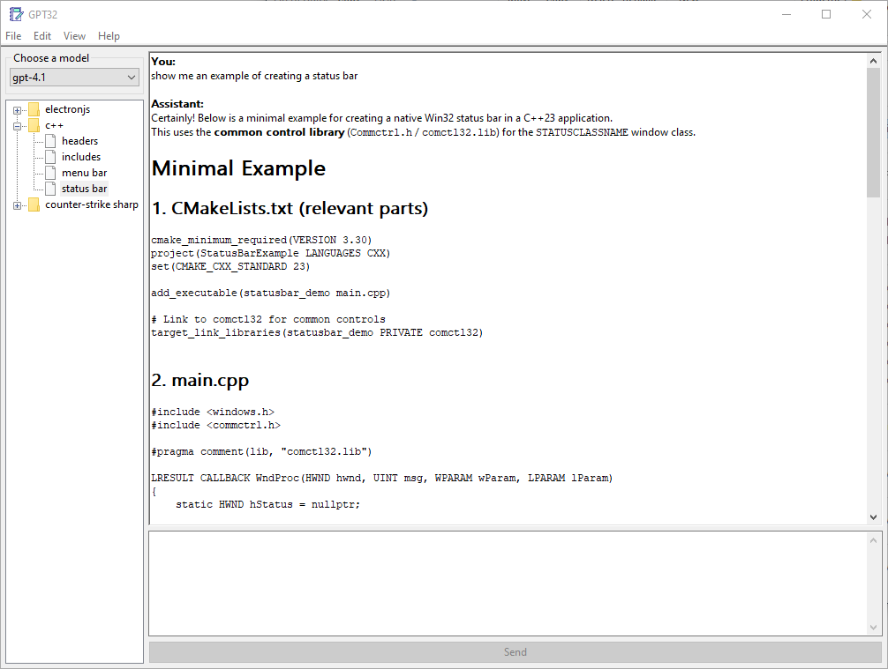

# GPT32

Minimal ChatGPT client for Windows built entirely with the Win32 API.

## Credits

Application icon provided by [Icon-Icons](https://icon-icons.com/icon/book-address-education-bookmark-business-agenda-notebook/267267).
